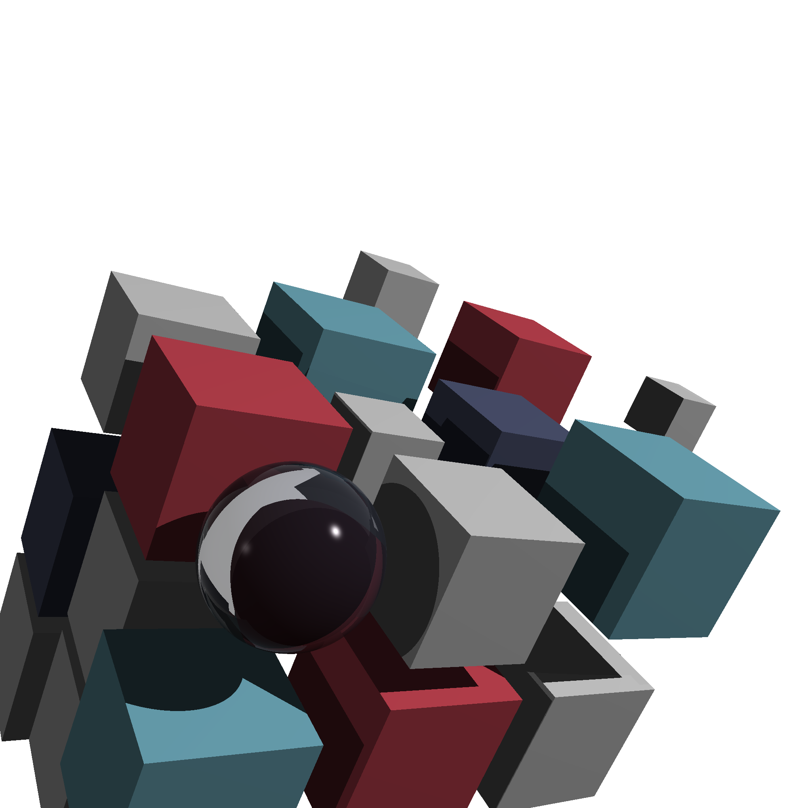

# Ray Tracer Challenge (by Jamis Buck) Implementation in C++20

This repository contains my implementation of the Ray Tracer Challenge, a book written by Jamis Buck, using C++.

## Getting Started

To use this library, include `RT.hpp` after compiling the necessary libraries. Refer to `CMakeLists.txt` for compilation details (The only dependency is `stl` & `C++20`).

### Example Usage

Explore `src/RT.cpp` for a example and demo showcasing how to render the cover of the book using the library. To build `RT`:
```console
mkdir build && cd build
cmake ..
make RT
```
Running `./RT` will create `sample.ppm` file in your build directory. (This will take long but you can reduce resolution in `src/RT.cpp`.



## License

This project is licensed under the [Apache License 2.0](LICENSE) - see the [LICENSE](LICENSE) file for details.
